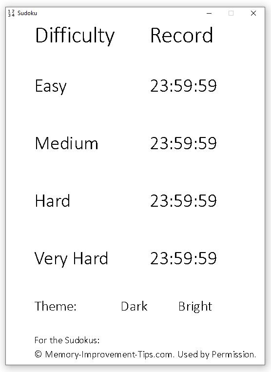
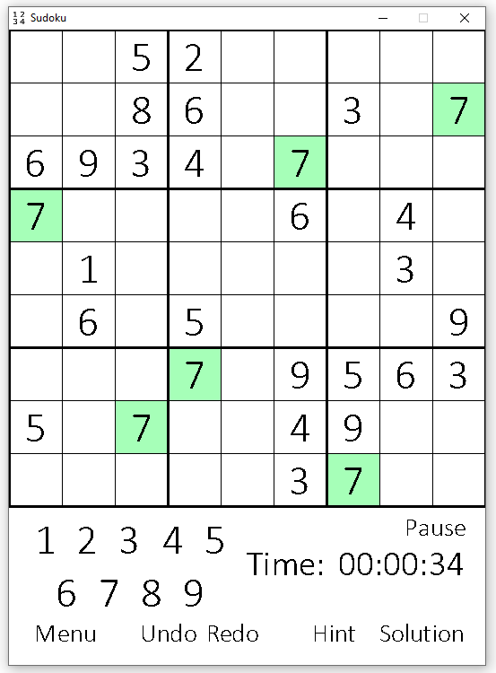

# Sudoku Application

This repository contains the code and .exe file for a Sudoku Application.
It was created using the python module pygame. You can choose between 4 different difficulty levels:

- Easy
- Medium
- Hard
- Very Hard

The welcome screen (first screenshot) gives an overview over the records, which are stored permanently, for the different difficulty levels.
It's also the place, where you can choose the difficulty level in which you want to play and the theme (Dark or Bright).
The game screen is very straight forward. You have the option to un- or redo your actions of to get hints for single cells.

The Sudokus are provided by [Memory-Improvement-Tips.com](https://www.memory-improvement-tips.com/printable-sudoku-puzzles.html) and are used by permission.

Download size Sudoku.exe: 21.8 MB

### Screenshots

I apologize for the fact that the code is very cluttered.
I will work on the clarity of the code in the future.
